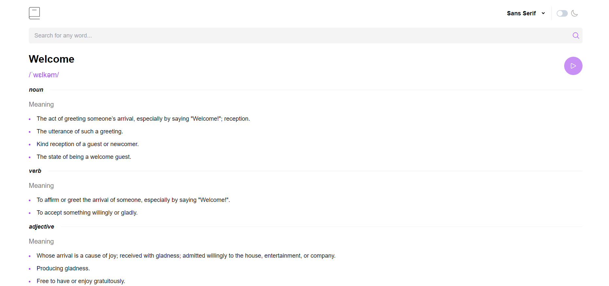
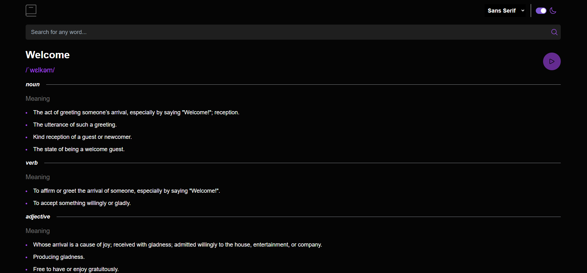
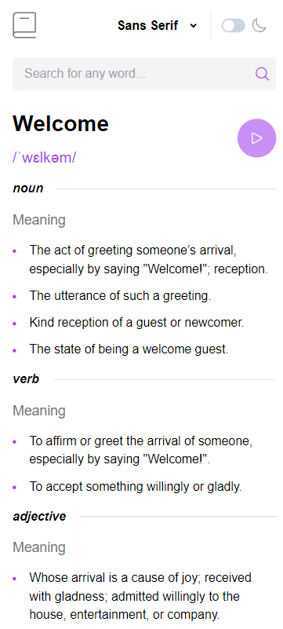
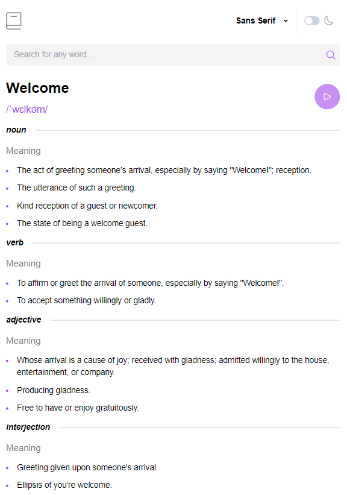

# Pocket Dictionary | [See it here!](https://p0cket-dicti0nary.netlify.app/)

## A simple dictionary web application built using React






### Features

This dictionary web app allows users to do just what you would expect from a dictionary—look up the meanings of different words. Each searched word will display all applicable meanings from three particular parts of speech: adjective, noun, and verb. The source of the definitions is also included at the very bottom. Synonyms are displayed for each word, and they can be selected to navigate to that synonym's definition page. Additionally, there is an option to hear the pronunciation of the searched word by clicking on the play button at the top right of the page. Additional quality-of-life features include:

- Dark Mode
- The ability to select one of three different font families to view the application in (Monospace, Sans Serif, and Serif)

### Limitations

This application is heavily limited by the API used to get the data for each word, called Free Dictionary API. After using the application for a bit, you might notice some peculiarities, such as the absence of an option to hear the pronunciation of certain words or the lack of definitions for synonyms that you can select. These issues stem from the fact that the data wasn't provided by the API, so there wasn't much I could do about words that might have these problems. I only discovered this issue after finishing the application and testing different searches. This experience has taught me a valuable lesson: I should test an API as much as possible before deciding to integrate it into an application. My eagerness to complete this app got the best of me, and I decided to go with the first API I found that looked good enough—now it's coming back to bite me in the butt 😓.

### Technology

This project was built using React, with a combination of Chakra UI and a small amount of Tailwind CSS for styling. Of course, the application is responsive for all screen sizes, ranging from a device as small as the Iphone SE all the way to desktops.The React Context API is employed for global state management, allowing any component in the app—regardless of how deeply nested—to access state without excessive prop drilling. This approach keeps each component cleaner by eliminating boilerplate code for receiving and passing props. It also avoids the need to lift state up to parent components if that state needs to be accessed by sibling components of a particular component later on.

### Installation

To set up and run the Pocket Dictionary web application locally, follow these steps:

1. **Download the project:**

   - You can either download the project as a ZIP file from the repository and extract it to your desired directory, **or** use `git clone` to clone the repository:
     ```bash
     git clone <repository-url>
     ```
   - Replace `<repository-url>` with the actual URL of the repository.

2. **Install dependencies:**

   - Open a terminal or command prompt and navigate to the directory where you extracted or cloned the project.
   - Run the following command to install all necessary dependencies:
     ```bash
     npm install
     ```

3. **Run the application:**
   - After the dependencies have been installed, start the development server by running:
     ```bash
     npm run dev
     ```
   - The application should now be running, and you can access it in your browser at `http://localhost:5173`
